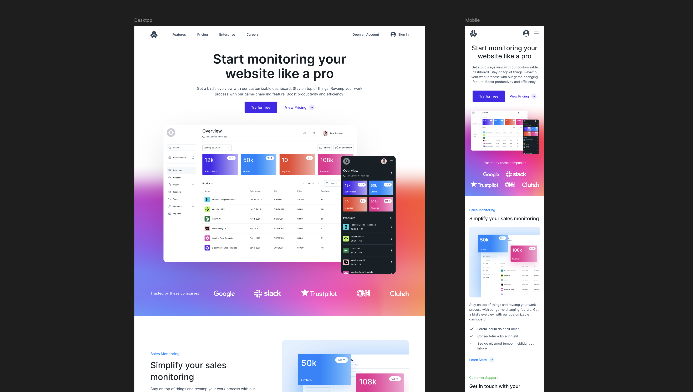

# UI/UX Prototype

<samp>A website made by converting Figma design into a responsive website with NextJS.</samp>

#
### Author
Edwin | [@edwiee](https://github.com/edwiee)

#
### 🚀 Done With
<code></code>&nbsp;&nbsp;
<code></code>&nbsp;&nbsp;
<code></code>&nbsp;&nbsp;

#
### 🧸 Quick Look
https://github.com/user-attachments/assets/0cce38f0-bfec-422d-9075-bcde3fc4ce63

#
### 🌿 Figma Design

#
### License

[MIT](https://choosealicense.com/licenses/mit/)

----

<samp>Made with ❤️ - <a href = "https://github.com/edwiee">edwiee</a></samp>

